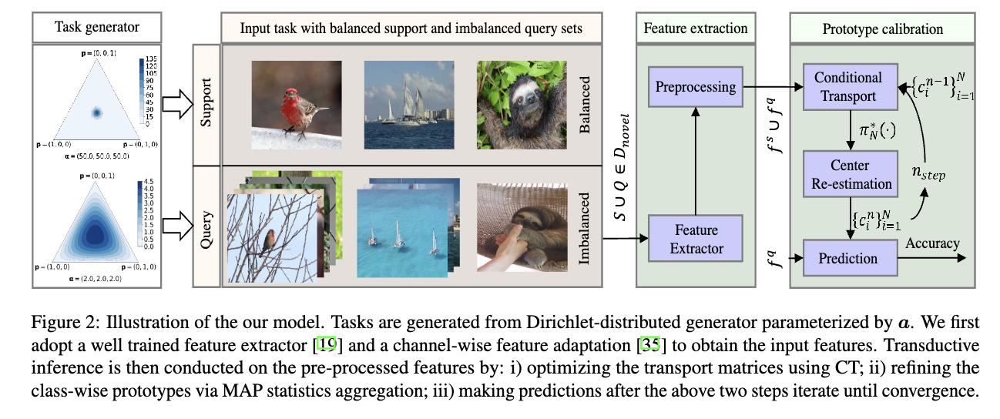

# PUTM
Official PyTorch Implementation of PUTM: [Prototypes-oriented Transductive Few-shot Learning with Conditional Transport(ICCV 2023)](https://arxiv.org/abs/2308.03047).

**Abstract:**

Transductive Few-Shot Learning (TFSL) has recently attracted increasing attention since it typically outperforms its inductive peer by leveraging statistics of query samples. However, previous TFSL methods usually encode uniform prior that all the classes within query samples are equally likely, which is biased in imbalanced TFSL and causes severe performance degradation. Given this pivotal issue, in this work, we propose a novel Conditional Transport (CT) based imbalanced TFSL model called **P**rototypes-oriented **U**nbiased **T**ransfer **M**odel (PUTM) to fully exploit unbiased statistics of imbalanced query samples, which employs forward and backward navigators as transport matrices to balance the prior of query samples per class between uniform and adaptive data-driven distributions. For efficiently transferring statistics learned by CT, we further derive a closed form solution to refine prototypes based on MAP given the learned navigators. The above two steps of discovering and transferring unbiased statistics follow an iterative manner, formulating our EM-based solver. Experimental results on four standard benchmarks including miniImageNet, tieredImageNet, CUB, and CIFAR-FS demonstrate superiority of our model in class-imbalanced generalization.



## Download Features
For WRN-28-10(S2M2) backbone, we used the pre-trained features provided by [S2M2_fewshot](https://github.com/nupurkmr9/S2M2_fewshot) and can be downloaded from here [checkpoints](https://drive.google.com/drive/folders/1KfPzwMvVzybvp13IQW5ipHvSxBncTA-C).

For WRN-28-10(softmax) and ResNet18 backbones, we used the pre-trained features provided by [TIM](https://github.com/mboudiaf/TIM) and can be downloaded from here [checkpoints](https://www.icloud.com/iclouddrive/0f3PFO3rJK0fk0nkCe8sDKAiQ#TIM).

If the above links are not available, you can also download features from here [features](https://drive.google.com/file/d/1RO1X989fK97ChSfPdhjDFccyu8FWUpZy/view?usp=sharing).

## Code Structure
```sh
├── features
│   ├── resnet18
│   │   ├── cub
│   │   └── mini
│   ├── wideres
│   │   ├── mini
│   │   └── tiered
│   └── wrn_s2m2
│       ├── cifar
│       ├── cub
│       ├── mini
│       └── tiered
├── PUTM
│   ├── cache
│   ├── config
│   │   ├── balanced
│   │   └── dirichlet
│   ├── datasets
│   ├── methods
│   ├── models
│   ├── split
│   │   ├── cub
│   │   ├── mini
│   │   └── tiered
│   └── train_mean # train_mean files for some methods, not necessary
```


## Evaluation

Firstly, you should modify the configuration file **"config/base_config.yaml"** for evaluation on different settings. (dataset, balanced/imbalanced, backbone, etc)

```sh
cd PUTM
mkdir cache

python eval.py --base_config config/base_config.yaml --method_config config/[balanced, dirichlet]/methods_config/[method_name].yaml
```

For example, if you want to evaluate PUTM on imbalanced setting, then use the following config file, 

```yaml
MODEL:
  arch: 'wrn_s2m2' # ('resnet18', 'wideres', 'wrn_s2m2')

DATA:
  dataset: 'mini' # ('mini', 'cub', 'cifar', 'tiered')
  batch_size_loader: 256
  enlarge: True
  num_workers: 4
  disable_random_resize: False
  jitter: False
  path: 'data'

EVAL:
  evaluate: True      # Set to True to evaluate methods
  number_tasks: 1000 # Number of tasks to evaluate
  batch_size: 1000
  n_ways: 5
  n_query: 15 # Balanced case: 15 query data per class
  balanced: 'dirichlet' # ('balanced' | 'dirichlet')
  alpha_dirichlet: 2
  model_tag: 'best'
  plt_metrics: ['accs']
  shots: [1, 3, 5]
  used_set: 'test'
  fresh_start: False

```

and run this command, 

```sh
python eval.py --base_config config/base_config.yaml --method_config   config/dirichlet/methods_config/putm.yaml
```

